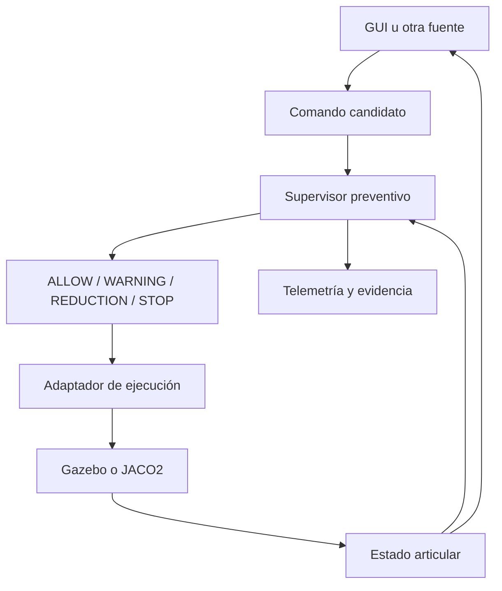

# TESIS_2_IMPLEMENTATION

**Plataforma preventiva desacoplada para comandos de movimiento en manipuladores robóticos**

Implementación experimental en ROS 2 de una capa que evalúa comandos articulares antes de transmitirlos al backend de ejecución. El sistema predice la evolución del manipulador durante un horizonte corto, estima su separación respecto del entorno y conserva la decisión más restrictiva entre `ALLOW`, `WARNING`, `REDUCTION` y `STOP`.

El Kinova JACO2 `j2n6s300` es el caso de estudio. La lógica preventiva permanece separada del robot, de la interfaz, de la fuente de obstáculos y del backend de simulación o hardware.

## Estado actual

**Base validada: 03/10/2026 — commit `2ddbbaa`.**

- Simulación y hardware físico tienen lanzamientos y adaptadores independientes.
- El brazo físico usa un adaptador nativo ROS 2–Kinova; no requiere ROS 1 ni `ros1_bridge`.
- El puente físico cubre lectura y movimiento supervisado de los seis ejes.
- La salida física está deshabilitada por defecto y exige doble habilitación.
- Se validaron conexión USB, estado articular, TF, diagnóstico, armado, desarmado, ejecución, retorno, HOLD y watchdogs.
- La base automatizada registra **175 pruebas, 0 errores, 0 fallos y 4 omitidas**.
- La prueba física de J6 terminó sin fallos, con control a 100 Hz y feedback a 20 Hz.
- La D435i dispone de un pipeline autónomo de preprocesamiento, diagnóstico y
  extracción de un obstáculo candidato. Su salida permanece aislada del
  supervisor hasta completar calibración y validación.

Resultados físicos de referencia:

| Propiedad | Resultado |
| --- | ---: |
| Movimiento solicitado en J6 | `+2.000°` |
| Movimiento observado en J6 | `+1.800°` |
| Error al final de la ida | `0.200°` |
| Error máximo después del retorno | `0.150°` |
| Variación máxima de los otros ejes | `0.000°` |
| Estado de ida y retorno | `SUCCEEDED` |
| Estado final | Desarmado, `HOLD`, `fault=false` |

La validación física fue ejecutada mediante un estímulo automatizado reproducible. No constituye todavía una caracterización completa del robot en todo su espacio articular.

## Objetivo y alcance

La capa preventiva se interpone entre las fuentes de comandos y el subsistema de ejecución. Su objetivo es detectar anticipadamente trayectorias incompatibles con el entorno, los límites articulares, las velocidades configuradas o la disponibilidad de datos.

Esta versión incluye:

- comandos por objetivo articular y control manual continuo;
- predicción discreta de horizonte corto;
- geometría configurable mediante cápsulas;
- evaluación de separación, tendencia, tiempo a colisión, límites y velocidad;
- autorización, reducción o bloqueo de comandos;
- respuesta conservadora ante datos vencidos y fallos del controlador;
- adaptadores separados para Gazebo y el JACO2 físico;
- trazabilidad de comandos, decisiones, estados y latencias;
- interfaz gráfica diferenciada para simulación y hardware.

El puente físico cubre exclusivamente los seis ejes del brazo. El gripper, los sensores FSR, el control cartesiano y el control de esfuerzo o torque quedan fuera de este contrato.

## Flujo de información



La GUI no controla directamente el robot. Publica una intención candidata; el supervisor la evalúa y solo la salida autorizada llega al adaptador activo. El estado medido en `/joint_states` realimenta al supervisor, la interfaz y la visualización.

Para el hardware físico, el adaptador transforma la orden aprobada en llamadas a la API USB de Kinova. En simulación, otro adaptador transmite la misma salida conceptual al controlador de Gazebo.

## Modos operativos

| Modo | Backend | Movimiento físico | Uso principal |
| --- | --- | ---: | --- |
| Simulación | Gazebo | No | Desarrollo y escenarios preventivos |
| Mock físico | Backend determinista | No | Validación offline del puente |
| Físico de solo lectura | USB Kinova | No | Estado, TF y diagnóstico |
| Físico habilitado | USB Kinova | Sí, después del armado | Operación articular supervisada |

No deben ejecutarse simultáneamente dos adaptadores JACO, ROS 1 ni herramientas que abran directamente la API Kinova. `jaco_hardware_node` usa un bloqueo del dispositivo para impedir un segundo propietario del USB.

## Organización del repositorio

| Componente | Responsabilidad |
| --- | --- |
| `src/thesis_interfaces` | Mensajes compartidos y contratos de comunicación |
| `src/thesis_description` | URDF/Xacro, mallas y configuración de RViz2 |
| `src/thesis_core` | Predicción, cinemática, geometría y supervisor preventivo |
| `src/thesis_simulation` | Gazebo y adaptadores exclusivos de simulación |
| `src/thesis_hardware_bridge` | Adaptador nativo ROS 2–API USB Kinova |
| `src/thesis_hardware` | Launch físico, readiness y reglas de acceso USB |
| `src/thesis_ui` | Interfaz articular para simulación y hardware |
| `src/thesis_telemetry` | Registro de métricas y eventos |
| `src/thesis_validation` | Evaluación reproducible de escenarios |
| `thesis_perception` | Procesamiento RGB-D autónomo y obstáculo candidato aislado |
| `tools/validation` | Ejecutores mock, físicos y de escenarios |
| `tools/realsense_d435i_test` | Adquisición y validación independiente de la D435i |
| `evidence/avance2` | Evidencia seleccionada de escenarios E01–E08 |
| `docs/implementation_notes` | Decisiones e instrucciones técnicas detalladas |

`build/`, `install/` y `log/` son resultados locales regenerables de `colcon` y no forman parte del código fuente versionado.

## Entorno de referencia

- Ubuntu 22.04
- ROS 2 Humble
- Gazebo Fortress, `ros_gz` y `gz_ros2_control`
- RViz2
- PyQt5
- `ros2_control` y `joint_trajectory_controller`
- Kinova JACO2 de seis ejes (`j2n6s300`)
- Intel RealSense D435i y Librealsense 2.58.4 para la preintegración perceptual

No se debe superponer este workspace Humble con un entorno ROS 2 Jazzy.

## Dependencia externa del JACO2

El código del proyecto está dentro de `TESIS_2_IMPLEMENTATION`. Los encabezados y la biblioteca USB de Kinova se mantienen como dependencia externa:

```text
~/Escritorio/TESIS_2_DEPENDENCIES/kinova-ros/kinova_driver
```

La ruta puede cambiarse mediante `KINOVA_ROOT`. El SDK no es necesario para ejecutar una compilación exclusivamente orientada a simulación.

## Instalación y compilación

### Obtener el repositorio

```bash
git clone https://github.com/ElLuisAlberto/TESIS_2_IMPLEMENTATION.git
cd TESIS_2_IMPLEMENTATION

source /opt/ros/humble/setup.bash
rosdep install --from-paths src thesis_perception --ignore-src -r -y
```

### Compilar simulación e interfaz

```bash
source /opt/ros/humble/setup.bash

colcon build --symlink-install --packages-up-to \
  thesis_simulation \
  thesis_ui \
  thesis_telemetry \
  thesis_validation \
  thesis_perception
```

### Compilar el sistema físico

```bash
source /opt/ros/humble/setup.bash

export KINOVA_ROOT="$HOME/Escritorio/TESIS_2_DEPENDENCIES/kinova-ros/kinova_driver"

colcon build --symlink-install \
  --packages-up-to thesis_hardware \
  --cmake-args -DKINOVA_ROOT="$KINOVA_ROOT"
```

La compilación física incorpora la ruta de la biblioteca Kinova al ejecutable. Para recompilar, se recomienda abrir una terminal nueva y evitar cargar previamente `install/setup.bash` del mismo workspace.

Después de la primera compilación física puede prepararse el acceso USB con:

```bash
bash tools/hardware/prepare_kinova_host.sh
```

El script instala la regla `udev`, comprueba la biblioteca y verifica los símbolos requeridos. Si añade al usuario al grupo `plugdev`, es necesario cerrar sesión y volver a ingresar.

## Ejecución

Antes de cualquier lanzamiento:

```bash
cd ~/Escritorio/TESIS_2_IMPLEMENTATION
source /opt/ros/humble/setup.bash
source install/local_setup.bash
```

### Simulación completa

```bash
ros2 launch thesis_simulation thesis_system.launch.py \
  obstacle_source_mode:=topic \
  simulation_output_enabled:=true \
  use_demo_obstacle:=true \
  start_gui:=true
```

Este launch inicia Gazebo, RViz2, controladores, obstáculo sintético, monitor de proximidad, supervisor, adaptador de simulación, horizonte e interfaz.

Los argumentos más relevantes son:

| Argumento | Función |
| --- | --- |
| `simulation_output_enabled` | Permite enviar a Gazebo comandos aprobados |
| `use_demo_obstacle` | Activa el obstáculo sintético |
| `obstacle_x`, `obstacle_y`, `obstacle_z` | Posición del obstáculo, en metros |
| `obstacle_radius` | Radio del obstáculo |
| `horizon_sec` | Duración del horizonte predictivo |
| `samples` | Cantidad de muestras del horizonte |
| `margin_m` | Margen geométrico adicional |
| `start_gui` | Abre la interfaz articular |

Para utilizar una fuente perceptual que publique `/thesis/obstacle_input`, ejecutar con `use_demo_obstacle:=false`.

### Hardware físico en solo lectura

La configuración predeterminada no permite movimiento:

```bash
ros2 launch thesis_hardware jaco_physical_system.launch.py \
  mock_hardware:=false \
  hardware_output_enabled:=false \
  use_demo_obstacle:=false \
  start_gui:=true \
  start_rviz:=true
```

En este modo se publican `/joint_states`, TF y diagnóstico. El readiness permanece bloqueado para comandos porque la salida no está armada.

### Hardware físico habilitado

Solo después de completar la validación mock, revisar el espacio del robot y mantener accesible la parada física:

```bash
ros2 launch thesis_hardware jaco_physical_system.launch.py \
  mock_hardware:=false \
  hardware_output_enabled:=true \
  use_demo_obstacle:=true \
  demo_obstacle_x:=2.0 \
  start_gui:=true \
  start_rviz:=true
```

`hardware_output_enabled:=true` únicamente permite solicitar el armado. El movimiento sigue bloqueado hasta que el operador arma el adaptador en tiempo de ejecución. La GUI muestra ambos estados y ordena el desarmado al cerrarse.

El obstáculo sintético lejano se utiliza solo en pruebas controladas. Para operación con percepción real debe desactivarse y reemplazarse por una fuente válida en `/thesis/obstacle_input`.

## Interfaz gráfica

En control por objetivo:

1. Esperar `/joint_states` y la conexión del backend.
2. En hardware, habilitar y confirmar el armado.
3. Esperar el estado `READY`.
4. Mantener desactivado el control manual y definir ángulos y duración.
5. Enviar el comando candidato.

En control manual:

1. Confirmar conexión, armado y estado `READY`.
2. Configurar la velocidad máxima y activar el modo manual continuo.
3. Colocar el cursor sobre la articulación y utilizar la rueda del mouse.
4. Detener la intención y comprobar la transición a `HOLD`.
5. Desactivar el modo manual antes de cerrar.

La GUI publica candidatos; nunca omite al supervisor ni controla directamente el backend.

## Interfaces principales

| Interfaz | Uso |
| --- | --- |
| `/joint_states` | Posiciones y velocidades medidas |
| `/thesis/candidate_command` | Objetivo articular candidato |
| `/thesis/supervised_command` | Objetivo autorizado |
| `/thesis/jog_intent` | Intención manual candidata |
| `/thesis/supervised_jog_command` | Intención manual autorizada o reducida |
| `/thesis/proximity_status` | Distancia y segmento limitante |
| `/thesis/trajectory_prediction` | Evaluación del horizonte candidato |
| `/thesis/execution_control` | Decisión preventiva durante la ejecución |
| `/thesis/execution_trajectory` | Estado de ejecución y resultado terminal |
| `/thesis/system_readiness` | `READY` o dependencias pendientes |
| `/thesis/hardware/diagnostics` | Estado del adaptador USB |
| `/thesis/hardware/armed` | Estado efectivo de armado |
| `/thesis/hardware/set_armed` | Servicio de armado y desarmado |

Publicar directamente al controlador omite la cadena preventiva y no constituye una prueba válida del sistema.

## Configuración preventiva

La configuración de referencia utiliza:

- horizonte de `1 s`;
- `21` muestras;
- actualización preventiva a `10 Hz`;
- margen espacial adicional de `0.02 m`;
- seis cápsulas asociadas a los segmentos principales del JACO2.

Los estados se interpretan así:

| Estado | Respuesta |
| --- | --- |
| `ALLOW` | Autoriza sin modificación preventiva |
| `WARNING` | Autoriza y registra una condición de atención |
| `REDUCTION` | Reduce la velocidad y reevalúa la trayectoria |
| `STOP` | Bloquea el comando o establece una referencia segura |

Una pérdida de datos, estado vencido, rechazo del controlador o fallo terminal produce una respuesta conservadora.

## Validación

### Pruebas automatizadas

```bash
cd ~/Escritorio/TESIS_2_IMPLEMENTATION
source /opt/ros/humble/setup.bash
source install/local_setup.bash

colcon test --packages-select \
  thesis_core \
  thesis_hardware_bridge \
  thesis_hardware \
  thesis_simulation \
  thesis_ui \
  thesis_perception \
  --event-handlers console_direct+

colcon test-result --verbose
```

Base validada:

```text
175 tests, 0 errors, 0 failures, 4 skipped
```

### Puente físico sin hardware

```bash
bash tools/validation/run_hardware_bridge_mock.sh
```

El mock comprueba armado, supervisión, ejecución, resultado terminal, desarmado y frecuencia de estado sin abrir el dispositivo USB.

### Micromovimiento físico reproducible

```bash
bash tools/validation/run_kinova_physical_micro_motion.sh
```

El ejecutor solicita la confirmación literal `MOVER J6`, arma el adaptador, ordena J6 `+2°`, retorna a la postura inicial y desarma incluso ante error. Toda la trayectoria atraviesa el supervisor preventivo.

## Diagnóstico rápido

```bash
ros2 topic echo /thesis/system_readiness
ros2 topic echo /thesis/hardware/diagnostics
ros2 topic echo /thesis/hardware/armed
ros2 topic hz /joint_states
```

Comprobaciones esperadas en hardware:

- un solo `jaco_hardware_node` posee el dispositivo USB;
- `connected=true` y `state_valid=true`;
- `fault=false`;
- aproximadamente 100 Hz en el lazo de control;
- aproximadamente 20 Hz en `/joint_states`;
- `armed=false` después de finalizar una prueba.

Si el SDK no informa número de serie y solo existe un JACO conectado, el adaptador selecciona de forma segura el dispositivo de índice cero y lo identifica como `KINOVA_USB_DEVICE_0`. Si hay más de un dispositivo, debe configurarse una identidad explícita.

## Seguridad operacional

- La salida física está deshabilitada por defecto.
- El movimiento exige permiso de lanzamiento y armado en tiempo de ejecución.
- El desarmado, un `STOP`, datos articulares vencidos o un watchdog activan `HOLD` o una detención conservadora.
- El adaptador conserva errores reales y finaliza limpiamente ante el apagado solicitado por ROS 2.
- Las validaciones deben ejecutarse con el área libre y la parada física accesible.
- Esta implementación es un prototipo de investigación y no reemplaza funciones de seguridad certificadas.

## Percepción D435i

La adquisición RGB-D e inercial permanece desacoplada del sistema preventivo.
El paquete `thesis_perception` preprocesa la nube, diagnostica frecuencia,
frame y timestamps, y extrae una esfera conservadora para un obstáculo
principal. La salida predeterminada es deliberadamente segura:

```text
/thesis/perception/obstacle_candidate
```

No se conecta automáticamente a `/thesis/obstacle_input`. Para caracterizar la
cámara sin Gazebo ni JACO2 puede utilizarse:

```bash
ros2 launch thesis_perception d435i_standalone.launch.py \
  start_rviz:=true
```

La referencia de adquisición y los reportes se encuentran en:

```text
tools/realsense_d435i_test/
```

La cámara todavía no publica una representación validada hacia
`/thesis/obstacle_input`. Permanecen como puertas de integración la extrínseca
medida, el recorte caracterizado del espacio de trabajo, la evaluación de error
espacial, la exclusión del propio manipulador y la respuesta ante pérdida del
sensor. La guía específica se encuentra en `thesis_perception/README.md`.

## Evidencia y documentación

- `evidence/avance2/`: matriz y evidencia seleccionada de simulación.
- `docs/implementation_notes/kinova_hardware_bridge.md`: diseño y operación del puente físico.
- `tools/validation/`: ejecutores reproducibles y validadores.
- `src/thesis_description/UPSTREAM.md`: procedencia del modelo Kinova.

## Limitaciones

- La validación física actual cubre un micromovimiento de J6 y su retorno, no todo el espacio articular.
- No se han caracterizado todavía seguimiento, frenado y latencia bajo distintas cargas.
- La matriz preventiva completa aún no se ha repetido sobre hardware físico con obstáculos reales.
- La D435i no participa todavía en las decisiones preventivas.
- No se ha demostrado portabilidad experimental con un segundo manipulador.
- El muestreo discreto no demuestra ausencia de colisión entre muestras.
- Gripper, FSR, control cartesiano y torque permanecen fuera del alcance actual.

## Trabajo futuro

- Integrar la D435i mediante una representación desacoplada de obstáculos.
- Calibrar la transformación entre cámara y base del robot.
- Repetir progresivamente la matriz de escenarios sobre hardware físico.
- Caracterizar seguimiento, latencia y frenado con distintas configuraciones y cargas.
- Evaluar la portabilidad con otro manipulador.

## Aporte de conocimiento

El aporte central es una arquitectura desacoplada que evalúa comandos articulares mediante una predicción geométrica de corto horizonte antes de permitir su ejecución. La separación entre intención, supervisión, adaptación al backend y evidencia permite conservar el núcleo preventivo al cambiar la interfaz, el entorno de ejecución, la fuente perceptual o el manipulador.

La correlación por identificador de comando, la conservación de decisiones terminales y el monitoreo durante la ejecución proporcionan trazabilidad desde la intención inicial hasta el resultado del controlador.
