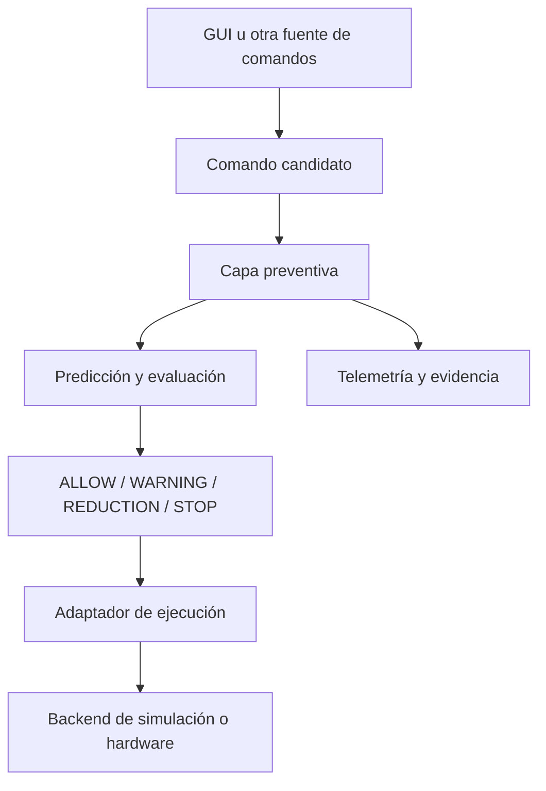

# TESIS_2_IMPLEMENTATION

**Plataforma preventiva desacoplada y adaptable para manipuladores robóticos**

Implementación experimental en ROS 2 de una capa desacoplada para la validación preventiva de comandos de movimiento en manipuladores robóticos. Antes de transmitir una orden al controlador, el sistema estima su evolución durante un horizonte temporal corto, evalúa la ocupación geométrica prevista y determina si corresponde autorizarla, autorizarla con advertencia, reducirla o bloquearla.

La arquitectura separa la lógica preventiva del modelo específico del robot, de la fuente de comandos, del entorno de ejecución y de la futura fuente de percepción. El Kinova JACO2 de seis grados de libertad constituye la instancia experimental utilizada para implementar y validar el Avance 2; no define el alcance conceptual de la propuesta.

**Estado actual (01/10/2026):** el sistema integrado se ejecuta localmente en simulación con el JACO2 como caso de estudio. El resumen de pruebas disponible en el workspace registra 149 tests, 0 errores, 0 fallos y 3 omitidos. La matriz de evidencia disponible en `evidence/avance2/` corresponde a E01–E08. Como etapa previa a la integración perceptual, se validó de forma independiente una cámara Intel RealSense D435i con imagen RGB, profundidad, nube de puntos coloreada, acelerómetro, giroscopio, fusión de orientación mediante Madgwick y visualización en RViz2. Esta adquisición todavía no alimenta las decisiones del supervisor preventivo.

## Objetivo y alcance

El objetivo técnico es interponer una capa de supervisión entre las fuentes de comandos y el subsistema de ejecución. Esta capa identifica anticipadamente trayectorias incompatibles con el entorno, límites articulares, restricciones de velocidad y fallos de ejecución, manteniendo el núcleo de decisión independiente del simulador, de la interfaz de usuario, del controlador y del manipulador empleados.

El criterio preventivo se fundamenta en la evolución prevista del movimiento, no únicamente en la distancia instantánea. Por ello, una separación actual reducida no debe producir por sí sola una limitación si la trayectoria se aleja del obstáculo y su ocupación futura resulta admisible. Recíprocamente, una configuración inicialmente libre puede requerir reducción o detención cuando las muestras futuras anticipan una condición restrictiva.

Esta versión comprende:

- comandos por objetivo articular y control manual continuo;
- predicción discreta de horizonte corto;
- representación geométrica configurable mediante una cadena de cápsulas;
- evaluación de distancia, tendencia, tiempo a colisión, límites articulares y velocidad;
- decisiones `ALLOW`, `WARNING`, `REDUCTION` y `STOP`;
- respuesta conservadora ante datos vencidos, rechazo o fallo del controlador;
- trazabilidad de comandos, decisiones, razones, segmentos y latencias;
- adaptadores para simulación, visualización y operación interactiva.

El control del gripper, los sensores FSR y la integración física se mantienen como líneas de trabajo separadas.

## Arquitectura del sistema



La decisión preventiva reside exclusivamente en el supervisor. El adaptador transforma su salida a la interfaz requerida por el backend activo, mientras que la telemetría y el registro de evidencias proporcionan observabilidad sin participar en la autorización. Esta distribución de responsabilidades permite sustituir el robot, el simulador, el controlador o la fuente perceptual sin redefinir el principio de evaluación.

### Adaptabilidad de la arquitectura

La adaptación a otro manipulador no requiere trasladar toda la implementación. El sistema distingue entre un núcleo invariante y un conjunto acotado de elementos dependientes de la plataforma:

| Elementos invariantes | Elementos que se adaptan |
| --- | --- |
| Secuencia de recepción, predicción, decisión y trazabilidad | Modelo cinemático y nombres de articulaciones |
| Estados `ALLOW`, `WARNING`, `REDUCTION` y `STOP` | Límites articulares y velocidades admisibles |
| Conservación de la condición más restrictiva | Geometría, cantidad y dimensiones de las cápsulas |
| Tratamiento de datos vencidos y fallos terminales | Transformaciones entre marcos de referencia |
| Interfaces conceptuales de candidato, decisión y evidencia | Adaptador hacia el controlador disponible |
| Criterios de validación y correlación temporal | Fuente y formato de los obstáculos percibidos |

Una nueva integración debe proporcionar el estado articular, el modelo cinemático, la representación geométrica conservadora, las restricciones del manipulador y un adaptador capaz de ejecutar o bloquear la salida supervisada. La independencia arquitectónica no implica compatibilidad automática: cada plataforma requiere parametrización, calibración y validación propias.

### Organización del repositorio

| Componente | Responsabilidad |
| --- | --- |
| `thesis_interfaces` | Mensajes e interfaces compartidas |
| `thesis_description` | Modelo de la instancia experimental, mallas y configuración de visualización |
| `thesis_core` | Proximidad, cinemática, predicción y supervisión preventiva |
| `thesis_simulation` | Gazebo, cápsulas, controladores y adaptadores de simulación |
| `thesis_ui` | Entrada manual, objetivos articulares y presentación de estado |
| `thesis_telemetry` | Métricas y trazabilidad temporal |
| `thesis_validation` | Registro y evaluación reproducible de escenarios |
| `thesis_hardware` / `thesis_hardware_bridge` | Adaptación al hardware de la plataforma experimental, fuera de la validación actual |
| `thesis_perception` | Base de desarrollo para el futuro adaptador entre la percepción RGB-D y las interfaces desacopladas de obstáculos |
| `tools/realsense_d435i_test` | Ejecutor reproducible, referencia funcional y reportes locales de la D435i |
| `tools/validation` | Estímulos, verificadores y ejecutores por lotes |
| `evidence/avance2` | Matriz base seleccionada para la validación E01–E08 |

## Principio de funcionamiento

Cada comando candidato atraviesa la siguiente secuencia de procesamiento:

1. Adquisición del estado articular medido.
2. Generación discreta de configuraciones futuras dentro del horizonte definido.
3. Actualización de la representación geométrica configurada para el manipulador.
4. Evaluación de separación, tendencia, tiempo a colisión y restricciones cinemáticas.
5. Propagación de la condición más restrictiva del horizonte.
6. Autorización, escalamiento o bloqueo del comando.
7. Registro correlacionado de la decisión, su causa y el identificador del comando.

Cuando se aplica una reducción, la trayectoria resultante vuelve a evaluarse geométricamente; por tanto, el escalamiento no se limita a modificar un valor de velocidad. Asimismo, una decisión terminal no puede ser sustituida por muestras `ALLOW` posteriores pertenecientes al mismo comando.

### Horizonte y modelo geométrico

La configuración de referencia discretiza un horizonte de **1 s** en **21 muestras**, incorpora un margen geométrico de **0.02 m** y solicita una actualización de **10 Hz**. Cada muestra se representa mediante cápsulas, de modo que el volumen previsto conserva el espesor aproximado del manipulador incluso cuando el desplazamiento es nulo.

La representación por cápsulas es parametrizable en cantidad, posición y radio. Para la instancia experimental JACO2 se configuraron los siguientes seis segmentos:

1. `base_to_shoulder`
2. `shoulder_to_upper_arm`
3. `upper_arm_to_forearm`
4. `forearm_to_wrist_1`
5. `wrist_1_to_wrist_2`
6. `wrist_2_to_tool`

Sus radios conservadores son `(0.105, 0.105, 0.085, 0.075, 0.085, 0.090)` m. Estos valores pertenecen al caso de estudio y no constituyen parámetros generales de la arquitectura. Para conservar la coherencia interna, una misma configuración geométrica alimenta la predicción, el monitor y la visualización.

En los mensajes de control, `time_to_collision = -1` indica que no se identificó solapamiento en las muestras evaluadas. Este valor no constituye evidencia de seguridad fuera del horizonte ni en los intervalos comprendidos entre muestras consecutivas.

### Estados de decisión

| Estado | Respuesta |
| --- | --- |
| `ALLOW` | Autoriza el comando sin modificación preventiva |
| `WARNING` | Autoriza el comando y registra una condición de atención |
| `REDUCTION` | Aplica una escala restrictiva y reevalúa la trayectoria resultante |
| `STOP` | Bloquea el comando o establece una referencia segura |

La pérdida o caducidad de datos requeridos, los objetivos articulares inválidos y los estados terminales `FAILED` o `REJECTED` del controlador se resuelven mediante una respuesta conservadora de tipo fail-closed.

### Control manual

La interfaz gráfica publica la intención manual a una frecuencia nominal de 20 Hz. Su magnitud se estima mediante una ventana de **0.25 s** y se satura de acuerdo con la Vmáx configurada para cada articulación. Esta ventana corresponde al procesamiento de los eventos de la rueda del mouse y es independiente del temporizador de supervisión del adaptador.

El adaptador genera referencias de trayectoria de corta duración con un periodo configurado de **0.1 s**. Si no recibe una nueva orden supervisada durante **0.18 s**, emite una referencia `HOLD` trazable. La desaparición de la intención confirma el vencimiento lógico del comando, pero no demuestra por sí sola un frenado físico instantáneo.

## Interfaces principales

| Tópico o interfaz | Uso |
| --- | --- |
| `/joint_states` | Posiciones y velocidades medidas, asociadas por nombre |
| `/clock` | Tiempo de simulación |
| `/thesis/jog_intent` | Intención manual generada por la GUI |
| `/thesis/supervised_jog_command` | Intención manual autorizada o escalada |
| `/thesis/candidate_command` | Objetivo articular candidato |
| `/thesis/supervised_command` | Objetivo autorizado por el supervisor |
| `/thesis/proximity_status` | Separación geométrica actual y segmento crítico |
| `/thesis/system_readiness` | Estado `READY` o explicación de dependencias pendientes |
| `/thesis/system_ready` | Estado lógico de disponibilidad (`Bool`) |
| `/thesis/trajectory_prediction` | Evaluación predictiva del candidato |
| `/thesis/execution_control` | Decisión, escala y mínimo previsto durante la ejecución |
| `/thesis/execution_trajectory` | Referencia y estado de ejecución |
| `/thesis/horizon_volume` | Volumen previsto mostrado en RViz2 |
| `/arm_controller/follow_joint_trajectory` | Acción del controlador articular |

Publicar directamente al controlador omite la capa preventiva y no constituye una prueba válida del sistema.

## Validación experimental en simulación

El protocolo de validación del Avance 2 considera escenarios E01–E15. La evidencia versionada disponible en `evidence/avance2/` contiene la matriz `scenario_matrix_e01_e08.csv`, correspondiente a E01–E08. No se afirma aquí una consolidación de resultados E09–E15, ya que sus lotes no están incluidos en esa carpeta.

| Escenarios | Repeticiones `PASS` |
| --- | ---: |
| E01–E08 | Revisar los resultados y el conteo registrados en `evidence/avance2/scenario_matrix_e01_e08.csv` |
| E09–E15 | Escenarios considerados en el protocolo; resultados no consolidados en la evidencia versionada disponible |

Los conteos y estados de repetición deben interpretarse directamente desde la matriz disponible. Los resultados de otros escenarios requieren sus archivos de ejecución y criterios de aceptación asociados.

Propiedades verificadas:

- correlación de eventos entre supervisor, adaptador, controlador y referencia `HOLD`;
- medición monotónica del watchdog sin depender del reloj simulado;
- saturación de velocidad solicitada respecto de Vmáx;
- rechazo trazable de objetivos articulares inválidos;
- latencia registrada incluso cuando un comando termina antes del adaptador;
- `STOP` fail-closed ante fallo o rechazo del controlador;
- restauración de controladores y fuentes después de las inyecciones de fallo;
- coherencia entre la parametrización geométrica y la identidad de los segmentos evaluados.

El último resumen de pruebas registrado localmente, consultado el 30/09/2026, indica:

```text
149 tests, 0 errors, 0 failures, 3 skipped
```

Este resumen corresponde a los resultados disponibles en `build/` para `thesis_core`, `thesis_interfaces`, `thesis_simulation` y `thesis_ui`; debe actualizarse luego de una nueva ejecución de pruebas.

El README previo enumeraba los siguientes ejecutores de escenarios. Su presencia y resultados deben verificarse en el workspace antes de usarlos:

| Ejecutor | Cobertura |
| --- | --- |
| `run_e09_e10_failsafe_batch.sh` | Pérdida controlada de datos y respuesta fail-safe |
| `run_e11_watchdog_batch.sh` | Vencimiento del flujo JOG y publicación `HOLD` |
| `run_e12_capsule_batch.sh` | Identidad geométrica de las seis cápsulas |
| `run_e13_velocity_saturation_batch.sh` | Saturación de velocidad articular |
| `run_e14_rejection_batch.sh` | Rechazo de un objetivo inválido |
| `run_e15_controller_failure_batch.sh` | `STOP` ante rechazo o fallo del controlador |

La matriz disponible `evidence/avance2/scenario_matrix_e01_e08.csv` constituye la evidencia versionada identificada para E01–E08. No se incluyen aquí conteos de lotes que no estén respaldados por archivos disponibles.

## Alcance de validez y limitaciones

- Los resultados corresponden exclusivamente a un entorno controlado de simulación.
- La adaptabilidad arquitectónica se ha definido, pero todavía no se ha validado experimentalmente con un segundo modelo de manipulador.
- No se ha demostrado todavía el comportamiento completo sobre la plataforma física utilizada como caso de estudio.
- La adquisición RGB-D e inercial de la D435i fue validada de forma independiente, pero todavía no está conectada a `/thesis/obstacle_input` ni participa en las decisiones preventivas.
- El muestreo discreto no demuestra ausencia de colisión entre muestras.
- Los límites de intención no equivalen a una caracterización experimental de velocidad, latencia o frenado.
- La implementación constituye un prototipo de investigación y no reemplaza funciones de seguridad certificadas.

## Entorno de referencia

- Ubuntu 22.04
- ROS 2 Humble
- Gazebo Fortress
- `ros_gz` y `gz_ros2_control`
- RViz2
- Intel RealSense D435i, `realsense2_camera` y Librealsense 2.58.4 para la preintegración perceptual
- `imu_filter_madgwick` para la estimación de orientación sin magnetómetro
- PyQt5
- `ros2_control` y `joint_trajectory_controller`

La compilación debe realizarse en un entorno ROS 2 Humble consistente; no se admite la superposición con un workspace Jazzy. El SDK del manipulador físico utilizado como caso de estudio no es necesario para reproducir la validación en simulación.

## Compilación y ejecución

### 1. Obtención y compilación

```bash
git clone https://github.com/ElLuisAlberto/TESIS_2_IMPLEMENTATION.git
cd TESIS_2_IMPLEMENTATION

source /opt/ros/humble/setup.bash
rosdep install --from-paths src --ignore-src -r -y

colcon build --symlink-install --packages-select \
  thesis_interfaces \
  thesis_description \
  thesis_core \
  thesis_simulation \
  thesis_ui \
  thesis_telemetry \
  thesis_validation \
  thesis_perception
```

Para recompilar, se recomienda utilizar una terminal nueva y evitar que el workspace se cargue como su propio *underlay*.

### 2. Arranque integrado de la simulación

El launch integrado inicia Gazebo, RViz2, los controladores, el puente de obstáculo, el obstáculo sintético de prueba, el monitor de proximidad, el supervisor, el adaptador de comandos, la predicción de horizonte y la interfaz gráfica. Así se evita abrir procesos manualmente y se previenen nodos duplicados.

En una terminal nueva, carga ROS 2 Humble y el workspace, y ejecuta el lanzamiento integrado:

```bash
cd ~/Escritorio/TESIS_2_IMPLEMENTATION
source /opt/ros/humble/setup.bash
source install/setup.bash
ros2 launch thesis_simulation thesis_system.launch.py \
  obstacle_source_mode:=topic \
  simulation_output_enabled:=true \
  use_demo_obstacle:=true \
  start_gui:=true
```

El comando inicia el sistema completo sin abrir manualmente cada nodo. Los argumentos después del nombre del launch permiten cambiar las entradas de la ejecución. Por ejemplo, para editar la posición y las dimensiones del obstáculo, así como el horizonte de predicción:

```bash
ros2 launch thesis_simulation thesis_system.launch.py \
  obstacle_source_mode:=topic \
  simulation_output_enabled:=true \
  use_demo_obstacle:=true \
  start_gui:=true \
  obstacle_x:=0.60 \
  obstacle_y:=0.0 \
  obstacle_z:=0.65 \
  obstacle_radius:=0.12 \
  obstacle_uncertainty:=0.02 \
  obstacle_rate_hz:=10.0 \
  horizon_sec:=1.0 \
  samples:=21 \
  margin_m:=0.02 \
  preview_rate_hz:=10.0 \
  preview_source:=auto
```

Los argumentos configurables del launch principal son:

| Argumento | Función |
| --- | --- |
| `obstacle_source_mode` | Fuente de obstáculos que consume el monitor de proximidad |
| `use_demo_obstacle` | Activa o desactiva el obstáculo sintético |
| `obstacle_x`, `obstacle_y`, `obstacle_z` | Coordenadas del obstáculo en el mundo, en metros |
| `obstacle_radius` | Radio del obstáculo sintético, en metros |
| `obstacle_uncertainty` | Incertidumbre del obstáculo, en metros |
| `obstacle_rate_hz` | Frecuencia de publicación del obstáculo sintético |
| `horizon_sec` | Duración del horizonte predictivo, en segundos |
| `samples` | Cantidad de muestras discretas del horizonte |
| `margin_m` | Margen espacial adicional, en metros |
| `preview_rate_hz` | Frecuencia de actualización de la previsualización |
| `preview_source` | Fuente de la previsualización: `auto`, `intent` o `execution` |
| `simulation_output_enabled` | Habilita el envío al controlador de Gazebo de comandos aprobados por el supervisor |
| `start_gui` | Inicia o desactiva la interfaz gráfica |
| `readiness_timeout_sec` | Tiempo límite para recibir datos requeridos |
| `readiness_rate_hz` | Frecuencia de comprobación de disponibilidad |

Los umbrales y parámetros internos del supervisor y del adaptador que no figuran en esta lista mantienen los valores asignados en sus nodos o en `safety_pipeline.launch.py`; no se modifican con argumentos no declarados por el launch.

Para conectar una fuente perceptual que publique `/thesis/obstacle_input`, desactiva el obstáculo sintético:

```bash
ros2 launch thesis_simulation thesis_system.launch.py \
  obstacle_source_mode:=topic \
  use_demo_obstacle:=false \
  simulation_output_enabled:=true \
  start_gui:=true
```

`simulation_output_enabled` habilita únicamente el adaptador hacia Gazebo y no omite la autorización del supervisor.

En RViz2 usar `Fixed Frame: world`. El volumen predictivo se publica en `/thesis/horizon_volume` y las cápsulas actuales en `/thesis/robot_capsules`. Esperar a que los controladores alcancen el estado activo y los indicadores de conexión de la GUI estén verdes antes de probar movimientos.

El nodo `system_readiness` publica `READY` o una lista de dependencias pendientes en `/thesis/system_readiness`, y el estado lógico en `/thesis/system_ready`. La GUI integrada muestra este estado y mantiene deshabilitados los comandos mientras el sistema no esté `READY`. Para revisar el diagnóstico:

```bash
ros2 topic echo /thesis/system_readiness
```

### 3. Preintegración de la Intel RealSense D435i

La adquisición de la D435i se mantiene separada del lanzamiento de simulación para conservar el desacoplamiento y evitar que una dependencia del sensor afecte al núcleo preventivo. La referencia funcional se encuentra en:

```text
tools/realsense_d435i_test/baseline/run_pointcloud_imu_rviz_WORKING.sh
```

La copia de referencia queda identificada mediante `tools/realsense_d435i_test/baseline/SHA256SUMS`. Los registros generados durante la ejecución permanecen en `tools/realsense_d435i_test/reports/` y no forman parte del código versionado.

La configuración comprobada utiliza:

| Flujo | Configuración validada |
| --- | --- |
| Profundidad | 640 × 480 a 15 FPS |
| Color | 640 × 480 a 15 FPS |
| Nube de puntos | RGB-D sobre `/camera/d435i/depth/color/points` |
| Acelerómetro | 100 Hz |
| Giroscopio | 200 Hz |
| IMU unificada | `/camera/d435i/imu` |
| Orientación filtrada | `/camera/d435i/imu_filtered` mediante Madgwick |
| Interfaz USB comprobada | USB 3.2 |

Antes de ejecutar, deben cerrarse otras instancias de `realsense2_camera_node`, `imu_filter_madgwick_node` y RViz2. El sistema funcional completo se abre con:

```bash
cd ~/Escritorio/TESIS_2_IMPLEMENTATION
xhost +SI:localuser:root
sudo -E ./tools/realsense_d435i_test/scripts/run_pointcloud_imu_rviz.sh
```

El ejecutor inicia la cámara, espera los tópicos de nube e IMU, inicia Madgwick y abre RViz2. Al cerrar RViz2 también finaliza los procesos iniciados. La ejecución actual utiliza privilegios elevados debido al acceso del backend HID/IIO de la IMU; este requisito debe revisarse antes del despliegue físico definitivo.

Para observar la nube compensada por orientación en RViz2:

| Propiedad | Valor |
| --- | --- |
| `Fixed Frame` | `world` |
| Tópico `PointCloud2` | `/camera/d435i/depth/color/points` |
| `Style` | `Points` |
| `Size (Pixels)` | `2` |
| `Position Transformer` | `XYZ` |
| `Color Transformer` | `RGB8` |
| `Reliability Policy` | `Best Effort` |
| `Decay Time` | `0` |

La D435i no incorpora magnetómetro. Por ello, la orientación de Madgwick puede presentar deriva de yaw y no debe utilizarse como referencia absoluta del robot. En la integración física, la nube deberá transformarse a `base_link` mediante una extrínseca calibrada o mediante la cadena cinemática correspondiente al montaje. La IMU permanece disponible para observación, diagnóstico y caracterización dinámica.

La preintegración se considera una validación de adquisición. Aún faltan el recorte de la región de trabajo, la exclusión geométrica del propio manipulador, la representación genérica de obstáculos, el watchdog perceptual y la conexión controlada con `/thesis/obstacle_input`.

### 4. Operación de la interfaz

En control manual:

1. Esperar la recepción de `/joint_states`.
2. Configurar Vmáx y activar el control manual continuo.
3. Colocar el cursor sobre la barra de una articulación y usar la rueda del mouse.
4. Detener los pulsos y comprobar la desaparición de la intención y la contracción del horizonte.
5. Desactivar el modo antes de cerrar la interfaz.

En control por objetivo, mantener desactivado el modo manual, definir los ángulos y la duración, y enviar el candidato. La previsualización nominal permite inspeccionar la intención, pero no sustituye la autorización preventiva.

### 5. Ejecución de pruebas automatizadas

```bash
cd ~/Escritorio/TESIS_2_IMPLEMENTATION
source /opt/ros/humble/setup.bash
source install/setup.bash

colcon test --packages-select \
  thesis_core \
  thesis_simulation \
  thesis_telemetry \
  thesis_ui \
  thesis_validation

colcon test-result --verbose
```

Los ejecutores de `tools/validation/` realizan inyecciones controladas y deben utilizarse conforme a sus precondiciones, con la simulación y los nodos requeridos en ejecución. La publicación directa al controlador invalida la cadena preventiva evaluada.

### 6. Finalización y reinicio

Desactivar el control manual y cerrar con `Ctrl+C` en este orden: GUI, horizonte, pipeline y Gazebo/RViz2. Cuando cambien el supervisor o el adaptador, reiniciar todos los nodos afectados para evitar procesos con versiones anteriores.

## Trabajo futuro

- Caracterizar latencia, seguimiento y frenado sobre el manipulador físico.
- Integrar la adquisición RGB-D validada con una representación desacoplada de obstáculos y un tratamiento explícito de incertidumbre.
- Validar la transformación de obstáculos al marco del robot.
- Definir zonas de exclusión, condiciones de ensayo y parada externa.
- Repetir progresivamente la matriz con la plataforma física del caso de estudio.
- Verificar la portabilidad mediante una segunda configuración de manipulador.
- Estudiar el comportamiento entre muestras discretas del horizonte.

## Atribución

La procedencia del modelo Kinova se documenta en [`src/thesis_description/UPSTREAM.md`](src/thesis_description/UPSTREAM.md). Deben conservarse las licencias incluidas con los recursos derivados.

## Aporte de conocimiento

El aporte central del trabajo es una arquitectura desacoplada y adaptable para evaluar comandos articulares antes de su ejecución mediante una predicción geométrica de corto horizonte. A diferencia de una supervisión basada exclusivamente en distancia instantánea, la propuesta relaciona la decisión con la ocupación futura estimada del manipulador y con la dirección del movimiento candidato.

La implementación aporta, además, una separación explícita entre generación de comandos, decisión preventiva, descripción del robot, adaptación al backend y registro de evidencia. Los aspectos dependientes de la plataforma se concentran en el modelo cinemático y geométrico, sus restricciones, las transformaciones y el adaptador del controlador. En consecuencia, el principio de supervisión y la estructura de trazabilidad pueden conservarse ante cambios de manipulador, interfaz, simulador o fuente perceptual. La correlación por identificador de comando y la conservación de razones terminales proporcionan trazabilidad desde la intención inicial hasta el resultado de ejecución.

Finalmente, el protocolo de escenarios E01–E15 define condiciones para evaluar operación nominal, saturaciones, caducidad de datos, rechazo de objetivos y fallos del controlador. La evidencia versionada identificada actualmente corresponde a E01–E08. Los resultados obtenidos en simulación con el JACO2 definen una base experimental para futuras transferencias a hardware y a otros manipuladores. La generalización arquitectónica está sustentada por la separación de responsabilidades, pero su portabilidad deberá confirmarse mediante nuevas integraciones. Los resultados actuales no constituyen una validación física completa ni una certificación de seguridad.
